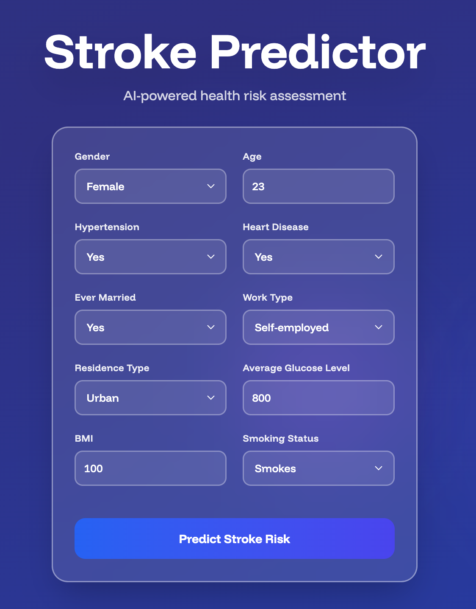
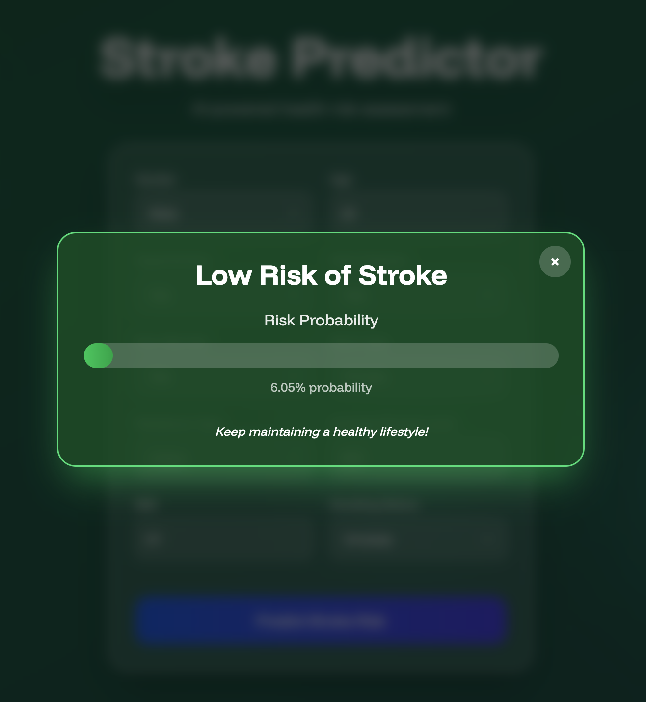

# Stroke Predictor

An AI-powered web application that predicts stroke risk based on patient health data using machine learning. The app features a beautiful, animated UI with real-time risk assessment and visual feedback.

## What is This App?

Stroke Predictor is a full-stack machine learning application that analyzes various health factors to predict the likelihood of stroke occurrence. It uses a trained Linear Discriminant Analysis (LDA) model with SMOTE oversampling to handle imbalanced data, providing accurate risk predictions with probability scores.

The application features:
- Real-time stroke risk prediction
- Interactive form with 10 health parameters
- Dynamic UI that changes color based on risk level
- Probability visualization with animated progress bars
- Responsive design with glassmorphism effects

## Screenshots

### Input Form


*The main interface where users input their health parameters*

### Low Risk Prediction


*Result screen showing low stroke risk with green theme*

### High Risk Prediction


*Result screen showing high stroke risk with red theme*

## Tech Stack

### Frontend
- **React 19.2.0** - UI framework
- **Vite 7.2.2** - Build tool and dev server
- **Tailwind CSS 4.1.17** - Utility-first CSS framework
- **JavaScript (ES6+)** - Programming language

### Backend
- **Flask 3.1.2** - Python web framework
- **Flask-CORS 6.0.1** - Cross-origin resource sharing
- **Python 3.10+** - Programming language

### Machine Learning
- **scikit-learn 1.7.2** - ML algorithms and preprocessing
- **imbalanced-learn 0.14.0** - SMOTE oversampling
- **pandas 2.3.3** - Data manipulation
- **numpy 2.2.6** - Numerical computing
- **joblib 1.5.2** - Model serialization
- **matplotlib 3.10.7** - Data visualization (training)

## Architecture

### Frontend Structure
```
frontend/
├── src/
│   ├── components/
│   │   ├── InputField.jsx      # Reusable form input component
│   │   ├── InputModal.jsx      # Main form with all health inputs
│   │   └── ResultModal.jsx     # Prediction result display
│   ├── App.jsx                 # Root component with dynamic background
│   ├── main.jsx                # React entry point
│   └── index.css               # Global styles and animations
├── public/                     # Static assets
├── index.html                  # HTML template
├── vite.config.js              # Vite configuration
└── package.json                # Dependencies and scripts
```

### Backend Structure
```
backend/
├── app.py                      # Flask API server
├── training.py                 # ML model training script
├── stroke_prediction_model.joblib  # Trained model
└── stroke.csv                  # Training dataset
```

## Components

### Frontend Components

#### 1. **App.jsx**
- Root component managing application state
- Handles dynamic background color transitions based on risk level
- Contains animated floating circles for visual appeal
- Manages `riskLevel` state (null, 'low', 'high')

#### 2. **InputModal.jsx**
- Main form component with 10 health parameter inputs
- Handles form state management and validation
- Makes API calls to backend for predictions
- Manages loading states and error handling
- Triggers ResultModal on prediction completion

#### 3. **InputField.jsx**
- Reusable input component for both text and select fields
- Supports number inputs, dropdowns, and text fields
- Features glassmorphism design with hover effects
- Handles onChange events and passes data to parent

#### 4. **ResultModal.jsx**
- Displays prediction results in a modal overlay
- Shows risk level (High/Low) with color-coded styling
- Animated probability bar visualization
- Provides health recommendations based on results
- Backdrop click to close functionality

### Backend Components

#### 1. **app.py**
- Flask REST API with CORS enabled for all origins
- `/predict` endpoint accepts POST requests with health data
- Loads pre-trained model and makes predictions
- Returns prediction (0/1) and probability score
- Serves the built frontend from `frontend/dist` directory
- Error handling and logging

#### 2. **training.py**
- Data preprocessing pipeline
- Feature engineering with PowerTransformer
- OneHotEncoder for categorical variables
- SMOTE oversampling for imbalanced data
- Linear Discriminant Analysis model
- Cross-validation with RepeatedStratifiedKFold
- Model serialization with joblib

## Model Details

The machine learning model uses:
- **Algorithm**: Linear Discriminant Analysis (LDA)
- **Preprocessing**: 
  - Median imputation for missing values
  - Yeo-Johnson power transformation
  - One-hot encoding for categorical features
- **Balancing**: SMOTE (Synthetic Minority Over-sampling Technique)
- **Validation**: 10-fold cross-validation with 3 repeats
- **Metric**: ROC-AUC score

### Input Features (10 parameters)
1. **Gender** - Male, Female, Other
2. **Age** - Numeric value
3. **Hypertension** - Yes (1) or No (0)
4. **Heart Disease** - Yes (1) or No (0)
5. **Ever Married** - Yes (1) or No (0)
6. **Work Type** - Private, Self-employed, Govt_job, children, Never_worked
7. **Residence Type** - Urban or Rural
8. **Average Glucose Level** - Numeric value (mg/dL)
9. **BMI** - Body Mass Index (numeric)
10. **Smoking Status** - formerly smoked, never smoked, smokes, Unknown

## Running the App Locally

### Prerequisites
- Node.js (v18 or higher) and npm
- Python 3.10 or higher
- pip (Python package manager)

### Step-by-Step Instructions

#### Step 1: Clone or Download the Repository
```bash
git clone <repository-url>
cd stroke-predictor
```

#### Step 2: Set Up the Backend

**a. Create a Python Virtual Environment**
```bash
python3 -m venv .venv
```

**b. Activate the Virtual Environment**
```bash
# On macOS/Linux:
source .venv/bin/activate

# On Windows:
.venv\Scripts\activate
```

**c. Install Python Dependencies**
```bash
pip install -r requirements.txt
```

**d. Start the Flask Server**
```bash
cd backend
python app.py
```

The backend server will start on `http://127.0.0.1:5000`

You should see output similar to:
```
 * Running on http://127.0.0.1:5000
```

#### Step 3: Set Up the Frontend

Open a new terminal window (keep the backend running).

**a. Navigate to Frontend Directory**
```bash
cd frontend
```

**b. Install Node Dependencies**
```bash
npm install
```

**c. Start the Development Server**
```bash
npm run dev
```

The frontend will start on `http://localhost:5173`

You should see:
```
  VITE v7.2.2  ready in XXX ms

  ➜  Local:   http://localhost:5173/
```

#### Step 4: Access the Application

Open your browser and navigate to:
```
http://localhost:5173
```

You should see the Stroke Predictor interface with an animated gradient background.

### Testing the Application

1. Fill in all 10 health parameter fields in the form
2. Click "Predict Stroke Risk"
3. Wait for the analysis (loading spinner will appear)
4. View the result modal with:
   - Risk level (High/Low)
   - Probability percentage
   - Visual progress bar
   - Health recommendation

### Stopping the Application

To stop the servers:
1. In the backend terminal: Press `Ctrl + C`
2. In the frontend terminal: Press `Ctrl + C`
3. Deactivate the Python virtual environment:
   ```bash
   deactivate
   ```

## Troubleshooting

### Backend Issues

**Port 5000 already in use:**
```bash
# Find and kill the process using port 5000
lsof -ti:5000 | xargs kill -9
```

**Module not found errors:**
```bash
# Ensure virtual environment is activated and reinstall
pip install -r requirements.txt
```

**Model file not found:**
- Ensure `stroke_prediction_model.joblib` exists in the `backend/` directory
- If missing, run `python training.py` to retrain the model

### Frontend Issues

**Port 5173 already in use:**
- Vite will automatically try the next available port
- Or specify a different port in `vite.config.js`

**CORS errors:**
- Ensure backend is running on `http://localhost:5000`
- Check that Flask-CORS is properly configured in `app.py`

**Dependencies installation fails:**
```bash
# Clear npm cache and reinstall
rm -rf node_modules package-lock.json
npm install
```

## Features

- **Dynamic Backgrounds**: UI changes from blue to green (low risk) or blue to red (high risk)
- **Glassmorphism Design**: Modern frosted glass effect on form elements
- **Smooth Animations**: Slide-in, bounce, and float animations
- **Responsive Layout**: Works on desktop, tablet, and mobile devices
- **Real-time Feedback**: Loading states and error handling
- **Accessibility**: Proper labels, ARIA attributes, and keyboard navigation

## Retraining the Model

If you want to retrain the machine learning model with new data:

1. Update the `backend/stroke.csv` file with your dataset
2. Run the training script:
   ```bash
   cd backend
   python training.py
   ```
3. This will generate a new `stroke_prediction_model.joblib` file
4. Restart the Flask server to use the new model

## License

This project is open source and available for educational purposes.

## Disclaimer

This application is for educational and informational purposes only. It should not be used as a substitute for professional medical advice, diagnosis, or treatment. Always consult with a qualified healthcare provider for medical concerns.
